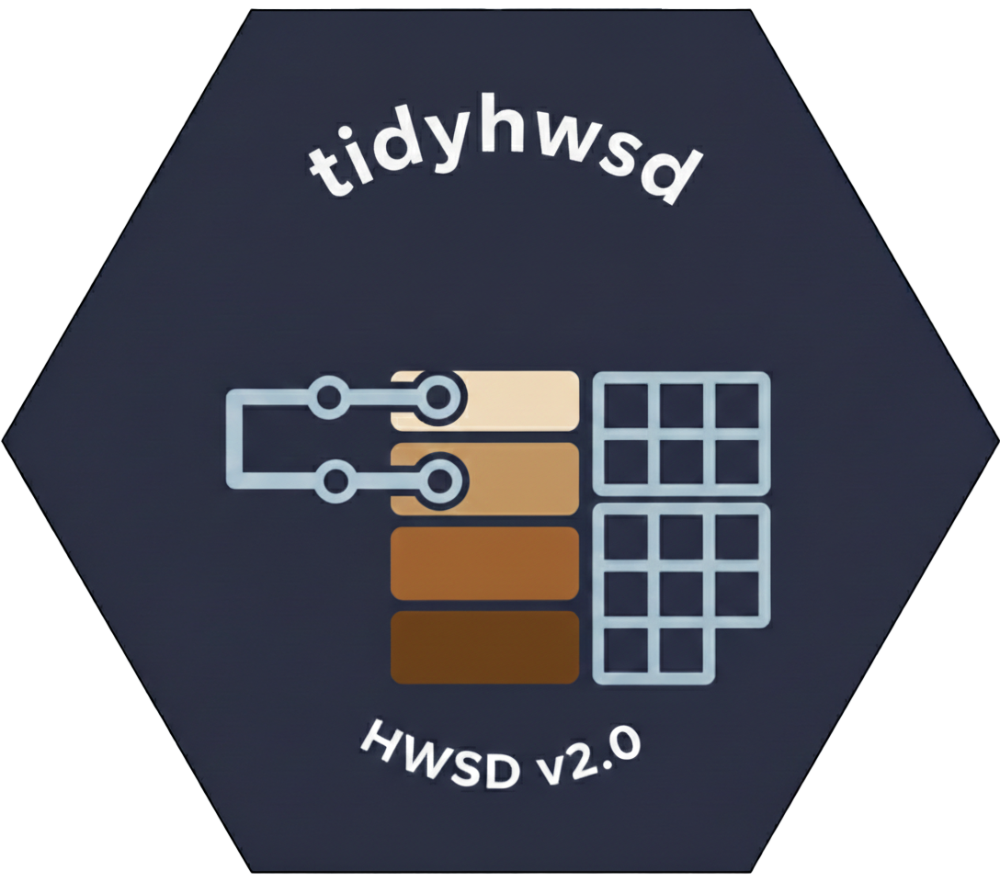

# tidyhwsd



Tidyverse-friendly access to the Harmonized World Soil Database (HWSD) v2.0.

Website: https://rimagination.github.io/tidyhwsd

## Installation

```r
install.packages("remotes")
remotes::install_github("Rimagination/tidyhwsd")
```

## Minimal example

```r
library(tidyhwsd)

# Download the HWSD index grid once
hwsd_download(ws_path = "D:/data/HWSD2", verbose = TRUE)

# Dominant-component values (default)
pt <- hwsd_extract(
  coords = c(110, 40),
  param = c("SAND", "PH_WATER"),
  layer = "D1",
  ws_path = "D:/data/HWSD2"
)

# Share-weighted synthesis
props <- hwsd_props()
pt_syn <- hwsd_compose(
  coords = c(110, 40),
  param = c("SAND", "PH_WATER"),
  layer = "D1",
  ws_path = "D:/data/HWSD2",
  props = props
)
```

## Notes

- Full tutorial and examples: https://rimagination.github.io/tidyhwsd/articles/tidyhwsd.html
- Units and aggregation guide: https://rimagination.github.io/tidyhwsd/articles/units-and-aggregation.html
- Set `WS_PATH` in `~/.Renviron` to avoid passing `ws_path` every time.
- If downloads are slow, manually download and extract the grid zip so `HWSD2.bil` exists:
  https://s3.eu-west-1.amazonaws.com/data.gaezdev.aws.fao.org/HWSD/HWSD2_RASTER.zip
